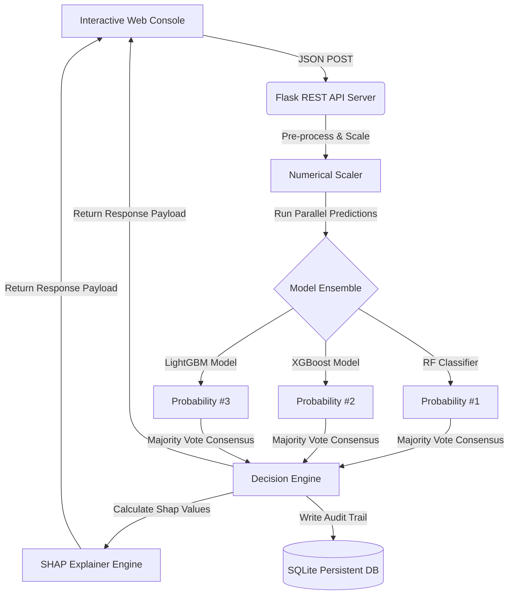

# 🛡️ Sentinel-Radar-CCFD
### Enterprise-Grade Credit Card Fraud Detection & Risk Analytics Platform

Sentinel-Radar-CCFD is a high-performance, production-ready Credit Card Fraud Detection and risk analytics console. Designed to mimic top-tier financial fraud desks (like Stripe Radar or Sift), this platform integrates three state-of-the-art machine learning classifiers via an ensemble consensus system, coupled with rich explainable AI (SHAP), a live feed simulator, and batch-upload processing.

---

## 🚀 Key Features

*   **⚡ Multi-Model Ensemble Consensus:** Computes real-time threat scores using a majority-vote consensus of three distinct classifiers:
    *   **Random Forest** (Depth-wise stability)
    *   **XGBoost** (Gradient-boosted decision trees)
    *   **LightGBM** (Leaf-wise speed optimization)
*   **🧠 Explainable AI (SHAP & Heatmaps):** Inline SHAP visualization detailing exactly which PCA-transformed features push transaction scoring towards *Approved* (Legitimate) or *Flagged* (Fraud), plus global feature correlation matrix heatmaps.
*   **📊 Dynamic Sensitivity Tuner:** Adjustable threshold slider (from 30% to 90%) allowing risk analysts to dynamically change system sensitivity, recalculating verdicts retroactively across the active session and review logs.
*   **🔄 Live Feed Simulator:** Fully automated simulated payment stream that auto-generates realistic synthetic transactions (30% fraud bias) to stress-test workflows and display live telemetry updates.
*   **📁 Batch processing Terminal:** Drag-and-drop CSV parser and JSON paste terminal that processes up to 100 transactions/second with custom sensitivity parameters.
*   **💾 Persistent SQLite Ledger:** Full SQLite backend auditing framework capturing transactional parameters, user metadata (names, devices, locations, merchants), and exact feature importance vectors.
*   **📑 Audit Reports:** One-click CSV audit ledger downloader and interactive single-transaction PDF risk report generator.

---

## 🛠️ Tech Stack & Architecture



### Backend
*   **Core:** Python (Flask, Flask-CORS)
*   **ML Classifiers:** Scikit-Learn (Random Forest), XGBoost, LightGBM
*   **AI Interpretability:** SHAP (Shapley Additive exPlanations)
*   **Database:** SQLite3

### Frontend
*   **Core:** Vanilla HTML5, CSS3, & Javascript (Modern Single Page App)
*   **Styling:** Curated sleek dark mode HSL palette, custom glassmorphism components
*   **Visualizations:** Chart.js (Line charts, Doughnut metrics, Histograms)
*   **Icons:** FontAwesome v6.4.0

---

## 📦 Installation & Quickstart

### Prerequisites
*   Python 3.8+
*   Pip (Python package manager)

### Setup & Run
1.  **Clone the repository:**
    ```bash
    git clone https://github.com/YOUR_USERNAME/Sentinel-Radar-CCFD.git
    cd Sentinel-Radar-CCFD
    ```

2.  **Initialize Python Virtual Environment:**
    ```bash
    python -m venv backend/venv
    # Windows:
    backend\venv\Scripts\activate
    # macOS/Linux:
    source backend/venv/bin/activate
    ```

3.  **Install Dependencies:**
    ```bash
    pip install -r backend/requirements.txt
    ```

4.  **Train Models (Optional - Pre-trained models included in `backend/models`):**
    If you wish to re-train the models with your own dataset, drop your `creditcard.csv` in `backend/` and run:
    ```bash
    python backend/train_models.py
    ```

5.  **Launch the Server:**
    ```bash
    python backend/app.py
    ```

6.  **Access the Console:**
    Open your browser and navigate to **`http://localhost:5000`**

---

## 🔌 API Developer Reference

Sentinel-Radar-CCFD includes standard REST API endpoints. You can run integration curl commands directly into the server:

### 1. Run Single Transaction Prediction
*   **Endpoint:** `POST /api/predict`
*   **Sample Command:**
    ```bash
    curl -X POST http://localhost:5000/api/predict \
      -H "Content-Type: application/json" \
      -d '{
        "Amount": 142.50,
        "Time": 43200,
        "Cardholder": "John Doe",
        "Merchant": "Amazon Web Services",
        "V1": -1.35, "V2": 0.42, "V3": -0.87,
        "V4": 1.05, "V5": 0.12, "V6": -0.34,
        "V7": 0.95, "V8": 0.08, "V9": -0.15,
        "V10": -0.21, "V11": 0.04, "V12": -0.55,
        "V13": 0.12, "V14": -0.98, "V15": 0.35,
        "V16": -0.24, "V17": -0.67, "V18": 0.11,
        "V19": 0.05, "V20": -0.12, "V21": 0.05,
        "V22": -0.42, "V23": 0.15, "V24": -0.31,
        "V25": 0.08, "V26": 0.12, "V27": -0.05,
        "V28": 0.03
      }'
    ```

---

## 📄 License
Distributed under the MIT License. See `LICENSE` for more details.
