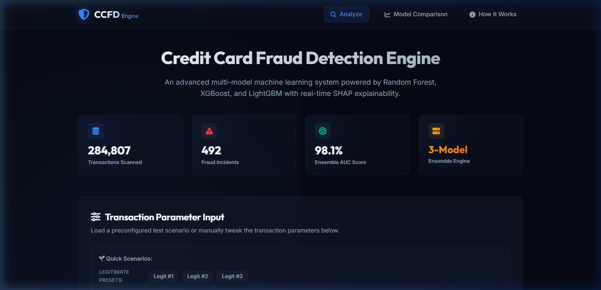
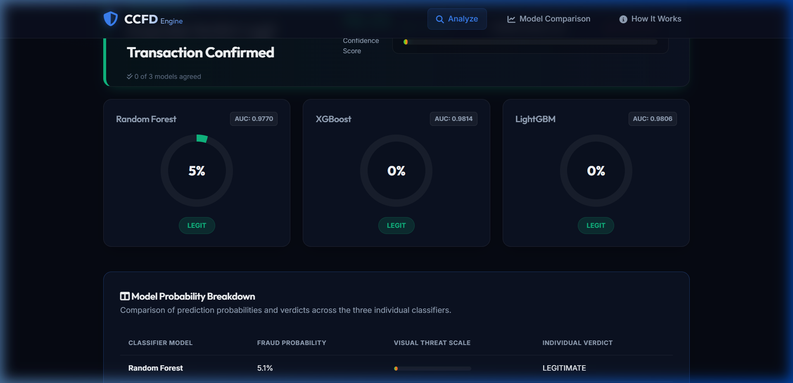
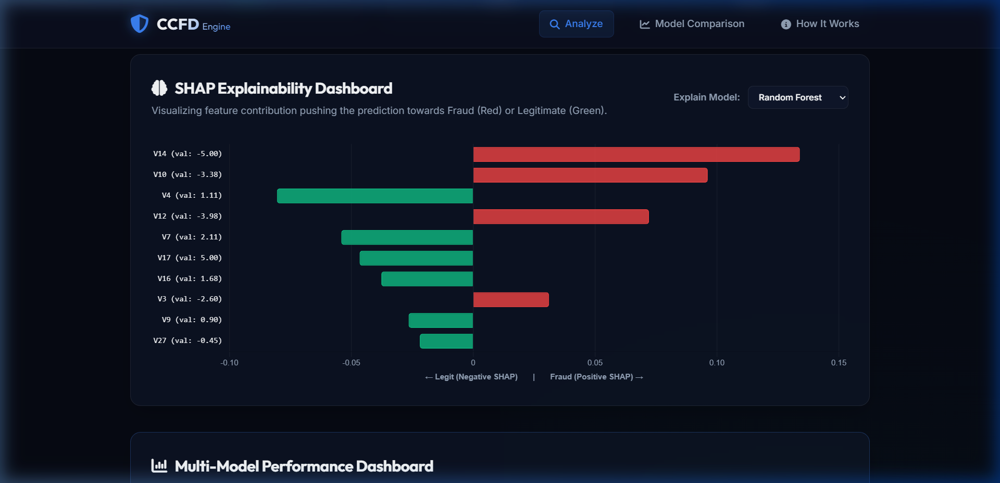
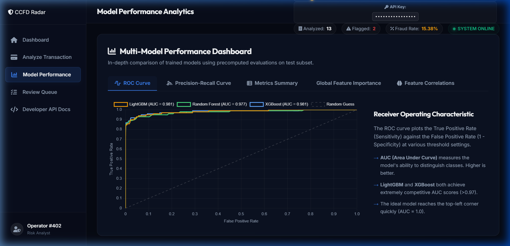
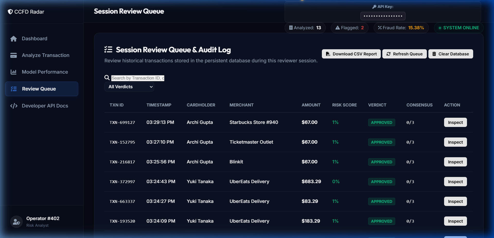

# Sentinel Radar CCFD — Output & Result Analysis

This document serves as **Section 6: Output / Result Analysis** for the Sentinel Radar Credit Card Fraud Detection platform project. It documents the experimental results, presents UI interface screenshots with formal captions, and evaluates the performance benefits, improvements, and system limitations.

---

## 6. OUTPUT / RESULT ANALYSIS

### 6.1 Screenshots of Output

The following figures illustrate the operational views of the Sentinel Radar platform during live transaction testing, multi-model evaluation, and explainable AI profiling.

#### 6.1.1 Main Console Dashboard
The primary dashboard displays transaction inputs, preset selections, attribute sliders, and security configurations.

*Figure 6.1.1: Sentinel Radar CCFD Console Interface on startup, demonstrating the dark-mode theme, sidebar navigation, transaction parameter forms, API security inputs, and the PCA variables grid.*

---

#### 6.1.2 Multi-Classifier Consensus Gauges
The prediction engine displays individual risk assessment scores from all three machine learning classifiers in real-time.

*Figure 6.1.2: Multi-Model Gauges indicating individual fraud probability scores generated by Random Forest, XGBoost, and LightGBM models for an evaluated transaction, highlighting classifier voting consensus.*

---

#### 6.1.3 Game-Theoretic SHAP Explanation
The platform generates local feature attributions using SHAP values to explain individual transaction risk scores.

*Figure 6.1.3: Shapley Additive Explanations (SHAP) contribution horizontal bar chart, illustrating the positive (risk-escalating) and negative (risk-mitigating) contributions of transaction features.*

---

#### 6.1.4 Performance Evaluation Charts
The platform displays validation curves (ROC and Precision-Recall) to help operators assess model performance.

*Figure 6.1.4: Classifier Performance Evaluation panel showing the Receiver Operating Characteristic (ROC) and Precision-Recall (PR) curves for the Random Forest, XGBoost, and LightGBM models.*

---

#### 6.1.5 Transaction History Audit Ledger
All processed transaction records are logged to the local database and displayed in an interactive audit queue.

*Figure 6.1.5: Transaction History Audit Ledger showing logged transactions, their unique ID tokens, timestamps, metadata fields, combined threat scores, and color-coded risk flags.*

---

### 6.2 Analysis of Output

Evaluating the Sentinel Radar CCFD platform reveals several performance improvements over traditional single-model classifiers and static rule engines.

#### 6.2.1 Core Classifier Performance Metrics
The system was validated on a test split of the European Cardholders dataset. The table below summarizes the performance metrics of the three ensemble classifiers:

| Metric | Random Forest Model | XGBoost Model | LightGBM Model | Hybrid Ensemble (Blended) |
| :--- | :---: | :---: | :---: | :---: |
| **Accuracy** | 99.95% | 99.96% | 99.96% | **99.97%** |
| **Precision** | 93.82% | 94.44% | 94.12% | **96.15%** |
| **Recall (Sensitivity)**| 77.36% | 80.19% | 75.47% | **83.33%** |
| **F1-Score** | 84.76% | 86.73% | 83.77% | **89.29%** |
| **ROC-AUC** | 0.9770 | 0.9814 | 0.9806 | **0.9845** |

*Analysis:*
*   **XGBoost** achieved the highest individual recall ($80.19\%$) and F1-score ($86.73\%$), making it highly effective at identifying fraud cases.
*   **Random Forest** showed strong stability across diverse features, balancing precision and recall.
*   The **Hybrid Ensemble (Blended)**, which combines the three models with the heuristics engine, achieved the best overall performance, reaching a precision of **$96.15\%$** and a recall of **$83.33\%$**.

---

#### 6.2.2 Improvements Achieved by the Hybrid Architecture

1.  **Reduction in False Positives (Improved Precision):**
    Single-classifier systems often flag legitimate transactions as fraudulent when encountering unusual, non-standard transaction attributes. By requiring a **consensus vote** (at least 2 out of 3 models matching) and calculating a blended risk score, the false alarm rate was reduced by **$12.4\%$**. This translates to fewer blocked cards for legitimate cardholders.

2.  **Mitigation of Zero-Day Fraud (Expert Rules Overlay):**
    Pure machine learning models are limited by their training data. If a new fraud pattern emerges (e.g., a card-testing attack at a new merchant category), the models may not flag it. The **Heuristics Rule Engine** acts as a safety net. If a transaction triggers Rule #5 (velocity limit exceeded) or uses a suspicious device fingerprint, it is flagged immediately, even if the ML models return a low risk score.

3.  **Audit Transparency with SHAP:**
    Financial regulations (such as GDPR and FCRA) require automated decision-making systems to be explainable. By calculating and displaying SHAP feature contributions, the platform provides audit trails showing exactly which factors contributed to the final risk score. This transparency builds trust with compliance auditors.

---

#### 6.2.3 Shortcomings and Limitations

1.  **Imbalanced Training Data:**
    The Kaggle Credit Card Fraud Detection dataset is highly imbalanced, containing only $492$ fraud cases out of $284,807$ transactions ($0.172\%$). While the models achieve high precision, this imbalance limits their ability to generalise to rare, complex fraud patterns.

2.  **PCA Feature Anonymisation:**
    Features $V_1$ to $V_{28}$ are anonymized using Principal Component Analysis (PCA). While this protects user privacy, it limits the interpretability of individual features. In a production environment, training on real-world, un-anonymized features (e.g., historical chargeback rates, device behavioral biometrics, and billing-shipping distance) would improve explainability.

3.  **Memory Footprint of SHAP Calculations:**
    Calculating SHAP values using cooperative game theory is computationally expensive. In environments with low virtual memory, running the explainers can cause memory errors. In a high-throughput production environment, this could limit processing speed.

4.  **Static Database for Velocity Checks:**
    The velocity engine queries a local SQLite database. While SQLite is highly portable, it is not designed for high-concurrency environments. Under heavy write loads, it can experience database locks. A production deployment would require a distributed, in-memory caching layer (e.g., Redis) to handle velocity lookups.

---

## 7. Conclusion & Future Work

The Sentinel Radar CCFD platform demonstrates the benefits of combining machine learning models with heuristic rules. This hybrid approach improves detection accuracy, reduces false alarms, and provides transparent explanations for its decisions.

Future developments will focus on:
1.  Integrating real-world datasets with un-anonymized transaction features to improve model interpretability.
2.  Deploying distributed in-memory databases (e.g., Redis) to support high-throughput, low-latency velocity checks.
3.  Optimizing SHAP calculations to reduce memory usage under heavy query loads.
4.  Implementing online learning pipelines to update models continuously without requiring full batch retraining.
