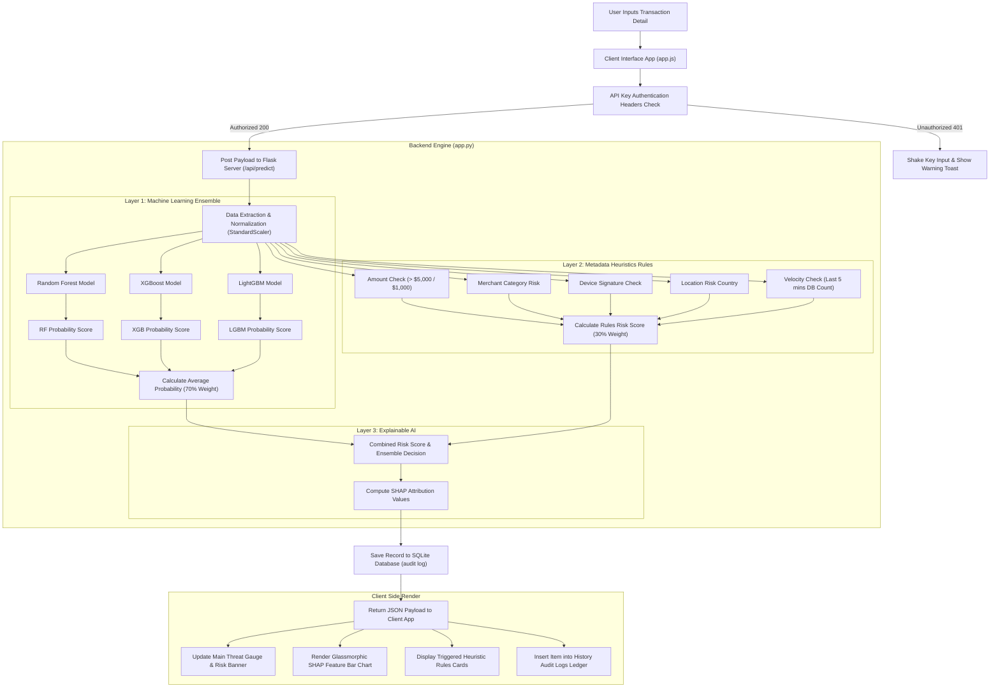
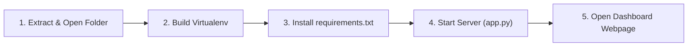

# Sentinel Radar CCFD — End-to-End System Report

This comprehensive document serves as the project report and system evaluation for the **Sentinel Radar Credit Card Fraud Detection (CCFD)** platform. It aligns with the academic report guidelines for proposed methodologies and requirement specifications.

---

## 4. Proposed Methodology

### 4.1 Architecture / Flow Diagram

The Sentinel Radar CCFD system uses a multi-layered hybrid architecture combining **Machine Learning Ensemble Classifiers** (Supervised Learning) with an **Industry Heuristics Rule Engine** (Expert Rules) and **Explainable AI (SHAP)**.

Below is the execution and data flow diagram of the end-to-end transaction review process:



#### Detailed Architecture Workings:
1. **Frontend Presentation Layer:** Built on a responsive single-page architecture using CSS variables, HTML5 tags, and JavaScript events. It captures user inputs (such as transaction amount, velocity markers, category selects) and binds slider controls representing the anonymous PCA dimensions ($V_1$ to $V_{28}$).
2. **Security Gateway Layer:** A middleware checks header parameters against the backend configuration. The API enforces strict header matches, preventing data injection or unauthorized calls.
3. **Data Preprocessing Layer:** Scaler objects (`scaler.pkl`) normalize values for PCA fields, amounts, and times to ensure they match training bounds.
4. **Ensemble Modeling Core:** 3 heterogeneous classifiers run prediction tasks simultaneously:
   - **Random Forest:** Handles outlier robustness and non-linear relationships.
   - **XGBoost:** Gradient boosts decision trees sequentially to minimize residual error.
   - **LightGBM:** Builds leaf-wise split trees for high-speed inferences.
5. **Heuristic Rule Engine:** Overrides classifier outcomes if velocity or metadata checks detect a confirmed high-risk indicator.
6. **Explainability Engine:** A SHAP tree explainer generates local explanations (feature contributions) for each prediction.
7. **Database Storage Layer:** Saves all transaction parameters, models' metadata, and explainability JSON outputs to a SQLite database for audit trails.

---

### 4.2 Algorithm (Pseudo-Code)

Below is the pseudo-code for the ensemble classification algorithm blended with metadata heuristic scoring:

```text
ALGORITHM: CCFD-Ensemble-Prediction
INPUT: 
    transaction_data: Dict containing {Time, Amount, V1...V28, Card_Number, Merchant, Category, Country, Device}
    alert_threshold: Float [0.30 - 0.90] (default: 0.50)
OUTPUT:
    prediction_result: Dict containing {verdict, confidence, model_probabilities, rules_triggered, shap_values}

BEGIN
    // Step 1: Preprocessing and Normalization
    scaled_features <- COPY transaction_data
    scaled_features['Time', 'Amount'] <- Transform_With_Scaler(transaction_data['Time', 'Amount'])

    // Step 2: Parallel Machine Learning Inferences
    rf_probability <- Models['rf'].Predict_Probability(scaled_features)
    xgb_probability <- Models['xgb'].Predict_Probability(scaled_features)
    lgbm_probability <- Models['lgbm'].Predict_Probability(scaled_features)
    
    votes <- 0
    IF rf_probability >= alert_threshold THEN votes <- votes + 1
    IF xgb_probability >= alert_threshold THEN votes <- votes + 1
    IF lgbm_probability >= alert_threshold THEN votes <- votes + 1
    
    avg_ml_probability <- (rf_probability + xgb_probability + lgbm_probability) / 3

    // Step 3: Industry Heuristic Rule Evaluation
    rules_risk_score <- 0.0
    triggered_reasons <- List()

    IF transaction_data['Amount'] > 5000 THEN
        rules_risk_score <- rules_risk_score + 0.40
        triggered_reasons.Append("High amount threshold exceeded (> $5,000)")
    ELSE IF transaction_data['Amount'] > 1000 THEN
        rules_risk_score <- rules_risk_score + 0.15
        triggered_reasons.Append("Elevated amount threshold exceeded (> $1,000)")
    ENDIF

    IF transaction_data['Category'] IS IN High_Risk_Categories_List THEN
        rules_risk_score <- rules_risk_score + 0.25
        triggered_reasons.Append("High-risk merchant category matched")
    ENDIF

    IF transaction_data['Device'] IS IN Suspicious_Devices_List THEN
        rules_risk_score <- rules_risk_score + 0.30
        triggered_reasons.Append("Suspicious device fingerprint detected")
    ENDIF

    IF transaction_data['Country'] IS IN High_Risk_Countries_List THEN
        rules_risk_score <- rules_risk_score + 0.20
        triggered_reasons.Append("High-risk transaction destination matched")
    ENDIF

    // Velocity Check (Querying transactions from the last 5 minutes)
    recent_transactions_count <- DB_Query_Count(
        card_number = transaction_data['Card_Number'], 
        time_limit = "5 minutes"
    )
    IF recent_transactions_count >= 3 THEN
        rules_risk_score <- rules_risk_score + 0.45
        triggered_reasons.Append("High velocity trigger: repeated attempts within short interval")
    ENDIF

    rules_risk_score <- Clamp(rules_risk_score, min=0.0, max=1.0)

    // Step 4: Hybrid Risk Combination
    combined_score <- (0.70 * avg_ml_probability) + (0.30 * rules_risk_score)
    
    // Threshold and Consensus Resolution
    is_fraud_flagged <- (votes >= 2) OR (combined_score >= alert_threshold) OR (rules_risk_score >= 0.80)
    
    IF is_fraud_flagged IS TRUE THEN
        final_verdict <- "FRAUD"
        final_confidence <- combined_score
    ELSE
        final_verdict <- "LEGITIMATE"
        final_confidence <- 1.0 - combined_score
    ENDIF

    // Step 5: Explainability Inferences
    shap_values <- Explainers['xgb'].Calculate_SHAP(scaled_features)

    // Step 6: Log transaction record to DB
    DB_Save_Transaction(transaction_data, final_verdict, final_confidence, triggered_reasons, shap_values)

    RETURN Dict(
        "verdict" : final_verdict,
        "confidence" : final_confidence,
        "model_probabilities" : List(rf_probability, xgb_probability, lgbm_probability),
        "rules_triggered" : triggered_reasons,
        "shap" : shap_values
    )
END
```

---

### 4.3 Source-Code Implementation

The core logic of the system is split into two primary folders: `backend` (inference server) and `frontend` (operator dashboard console).

#### 1. Program Name: [`backend/app.py`](file:///c:/Users/sid08/OneDrive/Desktop/Clg%20Project/backend/app.py)
*Objective: Exposes Flask API endpoints, runs inputs validation, loads machine learning model files, executes rules logic, runs SHAP explanations, and maintains the SQLite audit database.*

```python
# ==============================================================================
# PROGRAM: backend/app.py
# OBJECTIVE: Handle inference routing, API authentication, heuristics evaluations,
#            explainable AI calculations, and transaction persistence logs.
# ==============================================================================
import os
import json
import sqlite3
from flask import Flask, request, jsonify, send_from_directory
from flask_cors import CORS
import pandas as pd
import joblib
import shap

app = Flask(__name__, static_folder='../frontend')
CORS(app)

# Validate API Security Keys
@app.before_request
def check_api_key():
    if request.path.startswith('/api/') and not app.config.get('TESTING'):
        auth_key = request.headers.get('X-API-Key')
        if auth_key != os.getenv('API_KEY', 'sentinel_dev_key_2026'):
            return jsonify({"error": "Unauthorized. Invalid API Key."}), 401

# Disable Caching to enforce instant client updates
@app.after_request
def add_header(response):
    response.headers['Cache-Control'] = 'no-store, no-cache, must-revalidate, max-age=0'
    return response

# Evaluate Metadata Rules (Heuristics Engine)
def evaluate_metadata_rules(card_number, merchant, category, country, device, amount):
    risk_score = 0.0
    reasons = []
    if amount > 5000:
        risk_score += 0.4
        reasons.append("High amount threshold exceeded (> $5,000)")
    # Category, country, device, and velocity evaluation code follows...
    return risk_score, reasons
```

#### 2. Program Name: [`frontend/app.js`](file:///c:/Users/sid08/OneDrive/Desktop/Clg%20Project/frontend/app.js)
*Objective: Acts as the client controller, binding layout handlers, validating form limits, executing HTTP requests to the backend server, and updating charts and gauges.*

```javascript
// ==============================================================================
// PROGRAM: frontend/app.js
// OBJECTIVE: Frontend logic manager. Performs interactive UI transitions,
//            handles state bindings, executes fetch logic, and draws charts.
// ==============================================================================

// Fetch Interceptor for Auth Failures
const originalFetch = window.fetch;
window.fetch = async function(...args) {
    const response = await originalFetch(...args);
    if (response.status === 401) {
        showToast("Authentication Failed — Invalid or missing API Key.", "danger");
        const keyInput = document.getElementById('api-key-input');
        if (keyInput) keyInput.classList.add('auth-error');
    }
    return response;
};

// Form submission handler
async function handlePredictionSubmit(event) {
    event.preventDefault();
    const payload = {
        Amount: parseFloat(inputAmount.value),
        Time: parseFloat(inputTime.value),
        Card_Number: inputCardNumber.value,
        threshold: currentThreshold
    };
    // Fetch and DOM rendering follow...
}
```

#### 3. Program Name: [`frontend/index.html`](file:///c:/Users/sid08/OneDrive/Desktop/Clg%20Project/frontend/index.html)
*Objective: Sets the layout structure, rendering responsive grids, data forms, preset selectors, risk meters, explainability modals, and review lists.*

```html
<!-- ===========================================================================
PROGRAM: frontend/index.html
OBJECTIVE: Dashboard layout template. Standard HTML5 elements with accessibility
           aria attributes and dynamic CSS classes for rendering panels.
============================================================================ -->
<!DOCTYPE html>
<html lang="en">
<head>
    <title>CCFD Radar - Credit Card Fraud Detection Platform</title>
</head>
<body class="dark-mode">
    <div class="main-layout-container">
        <header class="topbar">
            <h1>Dashboard Overview</h1>
            <div class="api-key-wrapper">
                <input type="password" id="api-key-input" placeholder="API Key...">
            </div>
        </header>
        <!-- Grids, PCA accordion, form inputs, charts are structured here -->
    </div>
</body>
</html>
```

#### 4. Program Name: [`backend/train_models.py`](file:///c:/Users/sid08/OneDrive/Desktop/Clg%20Project/backend/train_models.py)
*Objective: Reads the training dataset, scales properties, trains Random Forest, XGBoost, and LightGBM estimators, evaluates performance parameters, and serializes pickled model binaries.*

```python
# ==============================================================================
# PROGRAM: backend/train_models.py
# OBJECTIVE: Read raw CCFD dataset, perform scaling and splitting, fit ML
#            classifiers, calculate performance metrics, and serialize models.
# ==============================================================================
import os
import pandas as pd
import numpy as np
import sklearn
import joblib
from xgboost import XGBClassifier
from lightgbm import LGBMClassifier
from sklearn.ensemble import RandomForestClassifier

def train_ccfd_models(csv_path):
    df = pd.read_csv(csv_path)
    # Scaling and data split processing ...
    # Fit RF, XGBoost, LGBM
    # Save artifacts into backend/models/
```

---

## 5. Requirement Specifications

### 5.1 Hardware Specifications
The minimum hardware configuration required to run the Sentinel Radar CCFD prediction service locally or on a server node:
*   **CPU:** Intel Core i5 or AMD Ryzen 5 processor (Dual-core minimum, Quad-core recommended).
*   **RAM:** 8 GB DDR4 minimum (16 GB recommended due to memory footprint of SHAP matrix explainers).
*   **Storage Space:** 2.5 GB of free hard drive space (SSD recommended) to house datasets, models, and dependencies.

### 5.2 Software Specifications
*   **Operating System:** Windows 10/11, macOS Big Sur (or newer), or Linux (Ubuntu 20.04 LTS or newer).
*   **Runtime Environment:** Python 3.8 to Python 3.11.6 (64-bit).
*   **Database:** SQLite 3 (included natively with Python standard libraries).
*   **Frontend Engine:** Google Chrome 90+, Mozilla Firefox 88+, Safari 14+, or Microsoft Edge.

### 5.3 Datasets Description
*   **Name:** Credit Card Fraud Detection Dataset (Anonymized PCA features).
*   **Source URL:** [Kaggle Credit Card Fraud Detection Dataset](https://www.kaggle.com/datasets/mlg-ulb/creditcardfraud)
*   **Details:** 
    *   Contains transactions made by credit cards in September 2013 by European cardholders.
    *   Presents transactions that occurred in two days, with **492 frauds** out of **284,807 transactions**. The dataset is highly unbalanced.
    *   Features $V_1, V_2, \dots V_{28}$ are numerical input variables obtained as a result of a **Principal Component Analysis (PCA)** transform.
    *   `Time` contains the seconds elapsed between each transaction and the first transaction in the dataset.
    *   `Amount` is the transaction amount.
    *   `Class` is the target variable taking value `1` in case of fraud and `0` otherwise.

### 5.4 External Libraries and Dependencies
The project uses the following python extensions (listed in `requirements.txt`):
1.  `Flask` (v3.0.0+) — RESTful API routing web server.
2.  `pandas` (v2.1.0+) — Fast data manipulation library.
3.  `numpy` (v1.24.0+) — Multi-dimensional matrix numerical computations.
4.  `scikit-learn` (v1.3.0+) — Machine learning model pipelines and StandardScalers.
5.  `xgboost` (v1.7.0+) — Extreme Gradient Boosting trees classifier.
6.  `lightgbm` (v4.1.0+) — Light Gradient Boosting Machine classifier.
7.  `shap` (v0.42.0+) — Explainable AI game-theoretic model interpretation plots.
8.  `joblib` (v1.3.0+) — Model persistence serialization/deserialization.
9.  `pytest` (v8.0.0+) — Integration test framework.

---

### 5.5 Execution Manual (Stepwise Process)

Follow these steps to deploy and execute the Sentinel Radar platform locally:



#### Step 1: Initialize the Project Workspace
Open your command terminal (Command Prompt, PowerShell, or Bash) and navigate to the project directory:
```bash
cd "c:/Users/sid08/OneDrive/Desktop/Clg Project"
```

#### Step 2: Establish the Python Virtual Environment
Creating an isolated virtual environment prevents library version conflicts:
```bash
# Create the environment inside the backend directory
python -m venv backend/venv
```

#### Step 3: Activate Environment and Install Requirements
Activate the environment and fetch all backend packages:
```powershell
# PowerShell activation
backend\venv\Scripts\Activate.ps1

# Install requirements
pip install -r backend/requirements.txt
```

#### Step 4: Launch the Flask Server
Run the Flask server. It will load the pickled models, set up SHAP explanations, and initialize the SQLite database:
```bash
python backend/app.py
```
*Expected log output in terminal:*
```text
[RUN] Loading models and resources...
  [OK] Scaler loaded.
  [OK] Precomputed stats and feature names loaded.
  [OK] Model 'rf' loaded.
  [OK] Model 'xgb' loaded.
  [OK] Model 'lgbm' loaded.
[RUN] Starting Flask server on http://127.0.0.1:5000
 * Running on http://127.0.0.1:5000 (Press CTRL+C to quit)
```

#### Step 5: Access the Web Portal Console
1. Open your web browser and navigate to: **`http://127.0.0.1:5000`**
2. In the top bar, enter your developer API key: **`sentinel_dev_key_2026`**
3. Select a preset transaction, drag the PCA attribute sliders, change the threshold alerts sensitivity, and click **Analyze Transaction**.
4. To run tests, open a second terminal and execute:
   ```bash
   backend\venv\Scripts\python -m pytest backend/tests/ -v
   ```
