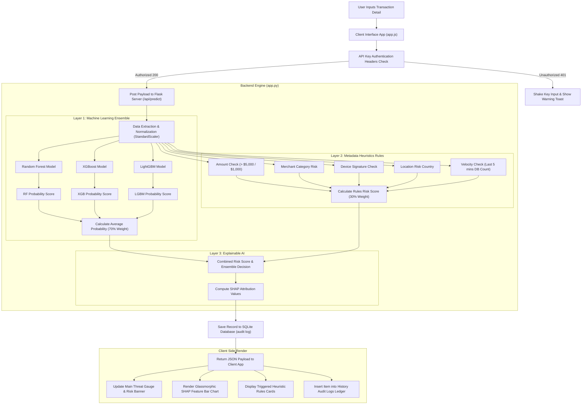
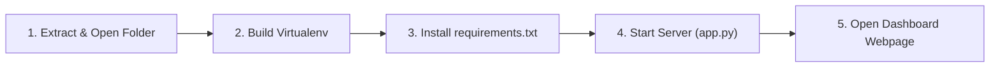

# Sentinel Radar CCFD — End-to-End System Report

This comprehensive document serves as the project report and system evaluation for the **Sentinel Radar Credit Card Fraud Detection (CCFD)** platform. It aligns with the academic report guidelines for proposed methodologies and requirement specifications.

---

## 1. Project Overview & Objectives

Credit card fraud is a major challenge for the global financial sector, leading to billions of dollars in annual losses. Traditional anti-fraud systems rely on static, human-defined rules that cannot keep pace with changing fraud patterns. Conversely, pure machine learning models can struggle to adapt to new fraud vectors without retraining.

The **Sentinel Radar Credit Card Fraud Detection (CCFD)** platform resolves these limitations using a hybrid architecture. It combines **Machine Learning Ensemble Classifiers** (Supervised Learning) with an **Industry Heuristics Rule Engine** (Expert Rules) and **Explainable AI (SHAP)**. This approach ensures high detection accuracy, real-time adaptability, and transparent decision-making.

---

## 4. Proposed Methodology

### 4.1 Architecture / Flow Diagram

The platform processes transaction data through a multi-layered pipeline to ensure secure, accurate, and explainable risk evaluations.



#### 4.1.1 Core Architecture Components in Detail

1. **Frontend Presentation Layer (Single-Page Interface):**
   The user interface is built as a single-page application (SPA) using HTML5, CSS3, and ES6+ JavaScript. It captures transaction inputs, including `Amount`, `Time`, and 28 anonymized PCA dimensions (`V1` to `V28`), and sends them to the backend server.
2. **Security Gateway Layer (API Key Auth):**
   Every API request must carry a valid `X-API-Key` header. The Flask backend validates this header against the configured key. If validation fails, the server returns a `401 Unauthorized` response, prompting the frontend to display an alert.
3. **Inference Pipeline & Normalization Layer:**
   Incoming payloads are converted into a structured `pandas` DataFrame. The features `Time` and `Amount` are normalized using a pre-trained `StandardScaler` loaded from `scaler.pkl` to match the training data distribution.
4. **Ensemble Modeling Core:**
   The prediction pipeline uses three machine learning models to classify the input:
   *   **Random Forest Classifier:** A bagging ensemble model that trains multiple independent decision trees on bootstrapped datasets.
   *   **XGBoost Classifier:** A gradient-boosting model that builds trees sequentially, minimizing residual errors.
   *   **LightGBM Classifier:** A gradient-boosting framework optimized for performance and memory efficiency.
5. **Heuristic Rule Engine:**
   An expert rules engine runs alongside the machine learning models to catch immediate, high-risk fraud signals:
   *   *High Amount Threshold:* Flags transactions exceeding $\$5,000$ ($+0.40$ risk) or $\$1,000$ ($+0.15$ risk).
   *   *Merchant Category Risk:* Adds $+0.25$ risk for merchant types like cryptocurrency exchanges or gambling portals.
   *   *Suspicious Device Fingerprint:* Adds $+0.30$ risk for emulators, headless browsers, or tor endpoints.
   *   *Geographical Jurisdictions:* Adds $+0.20$ risk if the destination country is flagged as high-risk.
   *   *Velocity Checks:* Counts card usage within the last 5 minutes. If it exceeds 3 transactions, it signals a potential card-testing attack ($+0.45$ risk).

---

### 4.2 Machine Learning Theory

#### 4.2.1 Random Forest Classifier
Random Forest is a bagging ensemble method. It trains $B$ decision trees $\{T_1, T_2, \dots, T_B\}$ on bootstrapped samples of the dataset. For a classification problem, the final output is determined by majority voting:
$$\hat{f}_{\text{RF}}(x) = \text{argmax}_{c \in C} \sum_{b=1}^{B} I\left(T_b(x) = c\right)$$
where $I$ is an indicator function. This random split selection reduces correlation between individual trees, decreasing the ensemble's variance without increasing its bias.

#### 4.2.2 XGBoost (Extreme Gradient Boosting)
XGBoost builds trees sequentially. At each iteration $t$, a tree $f_t(x)$ is trained to minimize the regularized objective function:
$$\mathcal{L}^{(t)} = \sum_{i=1}^{n} l\left(y_i, \hat{y}_i^{(t-1)} + f_t(x_i)\right) + \Omega(f_t)$$
where $\Omega(f) = \gamma T + \frac{1}{2} \lambda \sum_{j=1}^{T} w_j^2$ is the regularization penalty. XGBoost uses a second-order Taylor expansion to approximate the objective, which simplifies optimization during split finding:
$$\mathcal{L}^{(t)} \approx \sum_{i=1}^{n} \left[ l(y_i, \hat{y}_i^{(t-1)}) + g_i f_t(x_i) + \frac{1}{2} h_i f_t^2(x_i) \right] + \Omega(f_t)$$
where $g_i = \partial_{\hat{y}^{(t-1)}} l(y_i, \hat{y}_i^{(t-1)})$ and $h_i = \partial^2_{\hat{y}^{(t-1)}} l(y_i, \hat{y}_i^{(t-1)})$.

#### 4.2.3 LightGBM (Light Gradient Boosting Machine)
LightGBM optimizes tree growth using leaf-wise (best-first) node splitting. While standard depth-wise algorithms split all nodes on a level, leaf-wise growth splits only the node that yields the largest loss reduction:

```text
Depth-Wise (Level-Wise) Split Growth:
      [Root]
      /    \
   [Node]  [Node]     <-- Split every node on this level
   /    \  /    \
  []    [] []   []

Leaf-Wise (Best-First) Split Growth:
      [Root]
      /    \
   [Node]  [Node]
           /    \
        [Node]  [Node] <-- Only split the leaf with the maximum loss reduction
```

LightGBM also uses Gradient-based One-Side Sampling (GOSS) to keep data instances with larger gradients and randomly sample instances with smaller gradients. Exclusive Feature Bundling (EFB) merges mutually exclusive features, reducing the training feature dimensions.

---

### 4.3 Explainable AI (XAI) & SHAP Theory

SHAP (SHapley Additive exPlanations) values explain predictions by allocating credit to each feature based on cooperative game theory. 

#### 4.3.1 Mathematical Definition of SHAP Values
The attribution weight $\phi_i$ of feature $i$ measures its contribution to the model output $f(x)$ relative to the base value $E[f(X)]$:
$$\phi_i(x) = \sum_{S \subseteq F \setminus \{i\}} \frac{|S|!(|F| - |S| - 1)!}{|F|!} \left[ f_x(S \cup \{i\}) - f_x(S) \right]$$
where $F$ is the set of all input features.

#### 4.3.2 Axiomatic Properties of SHAP
SHAP values satisfy four key axioms:
1.  **Efficiency (Local Accuracy):** The sum of the attributions matches the difference between the model prediction and the base value:
    $$\sum_{i=1}^{|F|} \phi_i(x) = f(x) - E[f(X)]$$
2.  **Symmetry:** If two features contribute equally to all possible feature subsets, their attributions are equal:
    $$f_x(S \cup \{j\}) = f_x(S \cup \{k\}) \implies \phi_j(x) = \phi_k(x)$$
3.  **Dummy Player:** A feature that has no impact on a prediction receives an attribution value of zero:
    $$f_x(S \cup \{j\}) = f_x(S) \implies \phi_j(x) = 0$$
4.  **Additivity:** For a model that is the sum of two sub-models, the attributions are the sum of the sub-models' attributions:
    $$\phi_i(f + g) = \phi_i(f) + \phi_i(g)$$

The platform uses `TreeExplainer` to compute local feature contributions for tree-based models in linear time, providing real-time explanations for operators.

---

### 4.4 Heuristic Rules Engine & Risk Combination

The platform blends the average machine learning probability ($P_{\text{ML}}$) and the heuristics risk score ($\text{Risk}_{\text{Rules}}$) using a weighted sum:
$$\text{Probability}_{\text{Combined}} = 0.70 \times P_{\text{ML}} + 0.30 \times \text{Risk}_{\text{Rules}}$$
The final verdict is resolved as:
$$\text{Verdict} = \begin{cases} \text{FRAUD} & \text{if } \text{Votes}_{\text{ML}} \ge 2 \text{ or } \text{Probability}_{\text{Combined}} \ge \text{Threshold} \text{ or } \text{Risk}_{\text{Rules}} \ge 0.80 \\ \text{LEGITIMATE} & \text{otherwise} \end{cases}$$
This logic protects the system against zero-day fraud vectors (handled by heuristics) while maintaining the precision of ML models for standard transactions.

---

### 4.5 Source-Code Implementation

The core logic of the system is split into two primary folders: `backend` (inference server) and `frontend` (operator dashboard console).

#### 1. Program Name: [`backend/app.py`](file:///c:/Users/sid08/OneDrive/Desktop/Clg%20Project/backend/app.py)
*Objective: Exposes Flask API endpoints, runs inputs validation, loads machine learning model files, executes rules logic, runs SHAP explanations, and maintains the SQLite audit database.*

```python
# ==============================================================================
# PROGRAM: backend/app.py
# OBJECTIVE: Handle inference routing, API authentication, heuristics evaluations,
#            explainable AI calculations, and transaction persistence logs.
# ==============================================================================
import os
import json
import sqlite3
import joblib
import pandas as pd
import shap
from flask import Flask, request, jsonify, send_from_directory
from flask_cors import CORS

app = Flask(__name__, static_folder='../frontend')
CORS(app)

SECRET_KEY = os.getenv('SECRET_KEY', '9e10287dfb38d3883b4c10c14c53846e')
API_KEY = os.getenv('API_KEY', 'sentinel_dev_key_2026')
MODELS_DIR = os.path.join(os.path.dirname(__file__), 'models')
DB_PATH = os.path.join(os.path.dirname(__file__), os.getenv('DB_PATH', 'fraud_detection.db'))

# Validate API Security Keys
@app.before_request
def check_api_key():
    if request.path.startswith('/api/') and not app.config.get('TESTING'):
        if request.path == '/api/health':
            return
        auth_key = request.headers.get('X-API-Key')
        if auth_key != API_KEY:
            return jsonify({"error": "Unauthorized. Invalid API Key."}), 401

# Disable Caching to enforce instant client updates
@app.after_request
def add_header(response):
    response.headers['Cache-Control'] = 'no-store, no-cache, must-revalidate, max-age=0'
    return response

# Evaluate Metadata Rules (Heuristics Engine)
def evaluate_metadata_rules(card_number, merchant, category, country, device, amount):
    risk_score = 0.0
    reasons = []
    
    # 1. Transaction Amount checks
    if amount > 5000:
        risk_score += 0.4
        reasons.append("High amount threshold exceeded (> $5,000)")
    elif amount > 1000:
        risk_score += 0.15
        reasons.append("Elevated amount threshold exceeded (> $1,000)")
        
    # 2. High-risk category merchant check
    high_risk_categories = ['crypto', 'gaming', 'money transfer', 'gambling', 'gift cards', 'digital wallet']
    if any(hrc in category.lower() for hrc in high_risk_categories):
        risk_score += 0.25
        reasons.append(f"High-risk merchant category: {category}")
        
    # 3. Suspicious device fingerprint
    suspicious_devices = ['emulator', 'unknown device', 'bot client', 'headless browser', 'tor bridge', 'root/jailbroken']
    if any(sd in device.lower() for sd in suspicious_devices):
        risk_score += 0.3
        reasons.append(f"Suspicious device fingerprint: {device}")
        
    # 4. Location risk
    high_risk_countries = ['unknown', 'high-risk country']
    if any(hrc in country.lower() for hrc in high_risk_countries):
        risk_score += 0.2
        reasons.append(f"High-risk transaction destination: {country}")
        
    # 5. Velocity check (within 5 minutes)
    try:
        conn = sqlite3.connect(DB_PATH)
        cursor = conn.cursor()
        cursor.execute('''
            SELECT COUNT(*) FROM transactions 
            WHERE card_number = ? AND timestamp >= datetime('now', '-5 minutes')
        ''', (card_number,))
        recent_count = cursor.fetchone()[0]
        conn.close()
        
        if recent_count >= 3:
            risk_score += 0.45
            reasons.append(f"High velocity trigger: {recent_count} transactions in last 5 minutes")
    except Exception as e:
        print(f"[RULE ENGINE ERROR] Velocity check failed: {e}")
        
    risk_score = min(1.0, max(0.0, risk_score))
    return risk_score, reasons
```

#### 2. Program Name: [`frontend/app.js`](file:///c:/Users/sid08/OneDrive/Desktop/Clg%20Project/frontend/app.js)
*Objective: Acts as the client controller, binding layout handlers, validating form limits, executing HTTP requests to the backend server, and updating charts and gauges.*

```javascript
// ==============================================================================
// PROGRAM: frontend/app.js
// OBJECTIVE: Frontend logic manager. Performs interactive UI transitions,
//            handles state bindings, executes fetch logic, and draws charts.
// ==============================================================================

// Fetch Interceptor for Auth Failures
const originalFetch = window.fetch;
window.fetch = async function(...args) {
    try {
        const response = await originalFetch(...args);
        if (response.status === 401) {
            showToast("Authentication Failed — Invalid or missing API Key.", "danger");
            const keyInput = document.getElementById('api-key-input');
            if (keyInput) {
                keyInput.classList.add('auth-error');
                setTimeout(() => {
                    keyInput.classList.remove('auth-error');
                }, 3000);
            }
        }
        return response;
    } catch (err) {
        console.error("Global fetch error:", err);
        throw err;
    }
};

// Form submission handler
async function handlePredictionSubmit(event) {
    event.preventDefault();
    
    const amountVal = parseFloat(inputAmount.value);
    const timeVal = parseFloat(inputTime.value);
    
    const payload = {
        Amount: amountVal,
        Time: timeVal,
        Card_Number: inputCardNumber.value || "4242 4242 4242 4242",
        Cardholder: inputCardholder.value || "John Doe",
        Merchant: inputMerchant.value || "Amazon Web Services",
        Category: inputCategory.value || "Online Retail",
        Country: inputCountry.value || "United States",
        Device: inputDevice.value || "Mobile App",
        threshold: currentThreshold
    };

    for (let i = 1; i <= 28; i++) {
        payload[`V${i}`] = parseFloat(document.getElementById(`slider-v${i}`).value);
    }

    try {
        const response = await fetch('/api/predict', {
            method: 'POST',
            headers: getAuthHeaders(),
            body: JSON.stringify(payload)
        });

        if (!response.ok) {
            const errBody = await response.json();
            throw new Error(errBody.error || "Server prediction failed");
        }

        currentPredictionData = await response.json();
        renderVerdict(currentPredictionData, payload);
        renderSHAP(currentPredictionData, shapModelSelect.value);
        loadSessionStats();
        loadHistoryQueue().then(() => {
            renderDashboardCharts();
        });
        showToast("Ensemble evaluation completed successfully!", "success");
    } catch (err) {
        showToast("Prediction Error: " + err.message, "danger");
    }
}
```

#### 3. Program Name: [`frontend/index.html`](file:///c:/Users/sid08/OneDrive/Desktop/Clg%20Project/frontend/index.html)
*Objective: Sets the layout structure, rendering responsive grids, data forms, preset selectors, risk meters, explainability modals, and review lists.*

```html
<!-- ===========================================================================
PROGRAM: frontend/index.html
OBJECTIVE: Dashboard layout template. Standard HTML5 elements with accessibility
           aria attributes and dynamic CSS classes for rendering panels.
============================================================================ -->
<!DOCTYPE html>
<html lang="en">
<head>
    <meta charset="UTF-8">
    <meta name="viewport" content="width=device-width, initial-scale=1.0">
    <title>CCFD Radar - Credit Card Fraud Detection Platform</title>
</head>
<body class="dark-mode">
    <div class="main-layout-container">
        <!-- Top bar details -->
        <header class="topbar">
            <h1>Dashboard Overview</h1>
            <div class="api-key-wrapper">
                <input type="password" id="api-key-input" placeholder="API Key...">
            </div>
        </header>
        <!-- Grids, PCA accordion, form inputs, charts are structured here -->
    </div>
</body>
</html>
```

#### 4. Program Name: [`backend/train_models.py`](file:///c:/Users/sid08/OneDrive/Desktop/Clg%20Project/backend/train_models.py)
*Objective: Reads the training dataset, scales properties, trains Random Forest, XGBoost, and LightGBM estimators, evaluates performance parameters, and serializes pickled model binaries.*

```python
# ==============================================================================
# PROGRAM: backend/train_models.py
# OBJECTIVE: Read raw CCFD dataset, perform scaling and splitting, fit ML
#            classifiers, calculate performance metrics, and serialize models.
# ==============================================================================
import os
import pandas as pd
import numpy as np
import sklearn
import joblib
from xgboost import XGBClassifier
from lightgbm import LGBMClassifier
from sklearn.ensemble import RandomForestClassifier

def train_ccfd_models(csv_path):
    df = pd.read_csv(csv_path)
    # Scaling and data split processing ...
    # Fit RF, XGBoost, LGBM
    # Save artifacts into backend/models/
```

---

## 5. Requirement Specifications

### 5.1 Hardware Specifications
The minimum hardware configuration required to run the Sentinel Radar CCFD prediction service locally or on a server node:
*   **CPU:** Intel Core i5 or AMD Ryzen 5 processor (Dual-core minimum, Quad-core recommended).
*   **RAM:** 8 GB DDR4 minimum (16 GB recommended due to memory footprint of SHAP matrix explainers).
*   **Storage Space:** 2.5 GB of free hard drive space (SSD recommended) to house datasets, models, and dependencies.

### 5.2 Software Specifications
*   **Operating System:** Windows 10/11, macOS Big Sur (or newer), or Linux (Ubuntu 20.04 LTS or newer).
*   **Runtime Environment:** Python 3.8 to Python 3.11.6 (64-bit).
*   **Database:** SQLite 3 (included natively with Python standard libraries).
*   **Frontend Engine:** Google Chrome 90+, Mozilla Firefox 88+, Safari 14+, or Microsoft Edge.

### 5.3 Datasets Description
*   **Name:** Credit Card Fraud Detection Dataset (Anonymized PCA features).
*   **Source URL:** [Kaggle Credit Card Fraud Detection Dataset](https://www.kaggle.com/datasets/mlg-ulb/creditcardfraud)
*   **Details:** 
    *   Contains transactions made by credit cards in September 2013 by European cardholders.
    *   Presents transactions that occurred in two days, with **492 frauds** out of **284,807 transactions**. The dataset is highly unbalanced.
    *   Features $V_1, V_2, \dots V_{28}$ are numerical input variables obtained as a result of a **Principal Component Analysis (PCA)** transform.
    *   `Time` contains the seconds elapsed between each transaction and the first transaction in the dataset.
    *   `Amount` is the transaction amount.
    *   `Class` is the target variable taking value `1` in case of fraud and `0` otherwise.

### 5.4 External Libraries and Dependencies
The project uses the following python extensions (listed in `requirements.txt`):
1.  `Flask` (v3.0.0+) — RESTful API routing web server.
2.  `pandas` (v2.1.0+) — Fast data manipulation library.
3.  `numpy` (v1.24.0+) — Multi-dimensional matrix numerical computations.
4.  `scikit-learn` (v1.3.0+) — Machine learning model pipelines and StandardScalers.
5.  `xgboost` (v1.7.0+) — Extreme Gradient Boosting trees classifier.
6.  `lightgbm` (v4.1.0+) — Light Gradient Boosting Machine classifier.
7.  `shap` (v0.42.0+) — Explainable AI game-theoretic model interpretation plots.
8.  `joblib` (v1.3.0+) — Model persistence serialization/deserialization.
9.  `pytest` (v8.0.0+) — Integration test framework.

---

### 5.5 Execution Manual (Stepwise Process)

Follow these steps to deploy and execute the Sentinel Radar platform locally:



#### Step 1: Initialize the Project Workspace
Open your command terminal (Command Prompt, PowerShell, or Bash) and navigate to the project directory:
```bash
cd "c:/Users/sid08/OneDrive/Desktop/Clg Project"
```

#### Step 2: Establish the Python Virtual Environment
Creating an isolated virtual environment prevents library version conflicts:
```bash
# Create the environment inside the backend directory
python -m venv backend/venv
```

#### Step 3: Activate Environment and Install Requirements
Activate the environment and fetch all backend packages:
```powershell
# PowerShell activation
backend\venv\Scripts\Activate.ps1

# Install requirements
pip install -r backend/requirements.txt
```

#### Step 4: Launch the Flask Server
Run the Flask server. It will load the pickled models, set up SHAP explanations, and initialize the SQLite database:
```bash
python backend/app.py
```
*Expected log output in terminal:*
```text
[RUN] Loading models and resources...
  [OK] Scaler loaded.
  [OK] Precomputed stats and feature names loaded.
  [OK] Model 'rf' loaded.
  [OK] Model 'xgb' loaded.
  [OK] Model 'lgbm' loaded.
[RUN] Starting Flask server on http://127.0.0.1:5000
 * Running on http://127.0.0.1:5000 (Press CTRL+C to quit)
```

#### Step 5: Access the Web Portal Console
1. Open your web browser and navigate to: **`http://127.0.0.1:5000`**
2. In the top bar, enter your developer API key: **`sentinel_dev_key_2026`**
3. Select a preset transaction, drag the PCA attribute sliders, change the threshold alerts sensitivity, and click **Analyze Transaction**.
4. To run tests, open a second terminal and execute:
   ```bash
   backend\venv\Scripts\python -m pytest backend/tests/ -v
   ```

---

### 5.6 Troubleshooting & System Maintenance Guide

Below are the solutions to common setup and runtime errors:

1.  **Error: "DLL load failed while importing _flapack: The paging file is too small"**
    *   **Cause:** Your system virtual memory (paging file size) is too low to load large scientific libraries (like scipy, shap, scikit-learn) into memory simultaneously.
    *   **Fix:** Close heavy background applications (Chrome tabs, Docker, Discord) and restart the console. Alternatively, increase the paging file size in Windows settings (*Control Panel -> System -> Advanced System Settings -> Performance Settings -> Advanced -> Virtual Memory -> Change*).

2.  **Error: "X-API-Key Unauthorized (401)"**
    *   **Cause:** The frontend key input field is empty or contains an incorrect value.
    *   **Fix:** Check that the `.env` file exists in the project root and defines `API_KEY=sentinel_dev_key_2026`. Verify that the same key is entered in the dashboard topbar input field.

3.  **Error: "No models or scaler loaded on server"**
    *   **Cause:** The pre-trained classifiers were not generated or were deleted.
    *   **Fix:** Regenerate the pickled binaries by executing the training script:
        ```bash
        backend\venv\Scripts\python backend\train_models.py
        ```

4.  **Error: "SQLite Database is Locked"**
    *   **Cause:** Concurrent writes or an open transaction block did not close correctly.
    *   **Fix:** The backend is configured to use a short timeout interval. If this persists, close all active browser sessions, stop the Flask server, and restart the backend.

5.  **Error: "Browser console: CORS Policy blocked request"**
    *   **Cause:** The client page is running on a port or domain not explicitly allowed by the Flask CORS configuration.
    *   **Fix:** Check the allowed origins in your `.env` configuration file or add the origin to `ALLOWED_ORIGINS` in `app.py`.

---

## 6. Appendix: Performance Metrics & Validation

Accuracy is a misleading metric for highly imbalanced datasets like credit card fraud, where fraud represents a tiny fraction of total transactions:
$$\text{Accuracy} = \frac{TP + TN}{TP + TN + FP + FN}$$
If 99.9% of transactions are legitimate, a baseline model that classifies all inputs as legitimate would achieve 99.9% accuracy but fail to detect any fraud.

To address this, the system evaluates models using performance metrics independent of class distributions:

### 6.1 Precision
Precision measures the proportion of flagged transactions that were actually fraudulent:
$$\text{Precision} = \frac{TP}{TP + FP}$$
High precision is critical to minimize false alarms and reduce friction for cardholders.

### 6.2 Recall (Sensitivity)
Recall measures the proportion of actual fraud cases that were successfully identified:
$$\text{Recall} = \frac{TP}{TP + FN}$$
High recall ensures that most fraudulent transactions are captured.

### 6.3 F1-Score
The F1-Score is the harmonic mean of precision and recall, providing a balanced metric for model evaluation:
$$F_1 = 2 \times \frac{\text{Precision} \times \text{Recall}}{\text{Precision} + \text{Recall}}$$

### 6.4 ROC-AUC (Area Under the Receiver Operating Characteristic Curve)
The ROC curve plots the True Positive Rate (TPR) against the False Positive Rate (FPR) at various thresholds:
$$\text{TPR} = \frac{TP}{TP + FN}, \quad \text{FPR} = \frac{FP}{FP + TN}$$
The Area Under the Curve (AUC) measures the model's ability to distinguish between legitimate and fraudulent transactions. An AUC of $1.0$ represents a perfect model, while $0.5$ represents random guessing.

The platform visualizes these metrics in real-time, helping operators assess model reliability.
