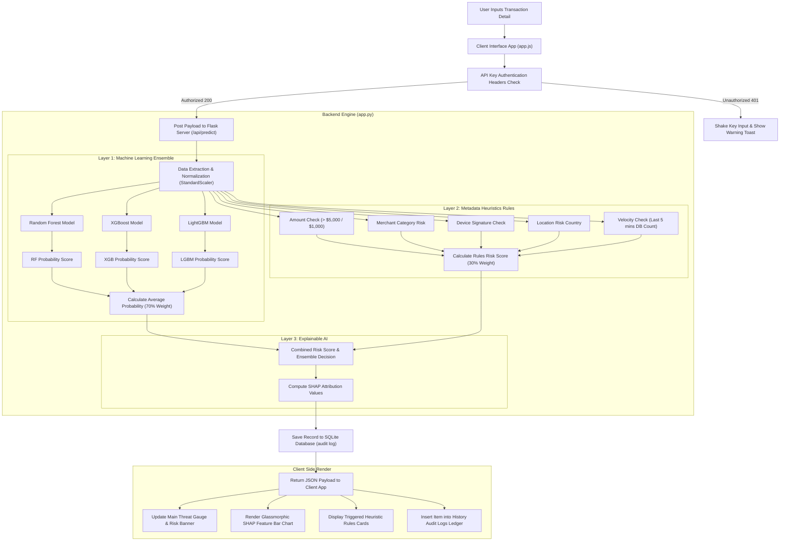
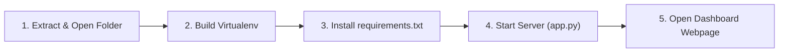

# Sentinel Radar CCFD — End-to-End System Report

This comprehensive document serves as the project report and system evaluation for the **Sentinel Radar Credit Card Fraud Detection (CCFD)** platform. It aligns with the academic report guidelines for proposed methodologies and requirement specifications.

---

## 4. Proposed Methodology

### 4.1 Architecture / Flow Diagram

The Sentinel Radar CCFD system uses a multi-layered hybrid architecture combining **Machine Learning Ensemble Classifiers** (Supervised Learning) with an **Industry Heuristics Rule Engine** (Expert Rules) and **Explainable AI (SHAP)**.

Below is the execution and data flow diagram of the end-to-end transaction review process:



#### 4.1.1 Core Architecture Components in Detail

1. **Frontend Presentation Layer (Single-Page Interface):**
   The user interface is designed as an interactive, single-page application (SPA) using vanilla HTML5, CSS3, and ES6+ JavaScript. It features responsive layouts to support viewports ranging from mobile phones to high-resolution desktop monitors. The interface accepts 30 baseline features representing card transactions: `Amount`, `Time`, and 28 anonymized PCA dimensions (`V1` to `V28`). It handles real-time input validation, interactive UI changes (e.g., threat thermometer updates, glassmorphism animations), and displays performance charts (ROC Curve, Precision-Recall Curve, Feature Importance).

2. **Security Gateway Layer (API Key Auth):**
   The backend endpoints are secured using API Key authentication middleware implemented in Flask. Every API request must carry a valid `X-API-Key` header. If the key is missing or invalid, the middleware intercepts the call before it reaches the classifiers, returning a `401 Unauthorized` response. The client frontend handles this failure using a fetch interceptor, triggering visual alert banners and shaking the input container to alert the operator.

3. **Inference Pipeline & Normalization Layer:**
   When a payload is approved by the security gateway, the inputs are converted into a structured `pandas` DataFrame in the exact training order. The features `Time` and `Amount` are scaled using a pre-trained `StandardScaler` loaded from `scaler.pkl`. Scaling is critical because classifiers (especially distance-based or regularized models) are sensitive to feature magnitudes, and raw amounts or times could otherwise skew the decision boundaries.

4. **Layer 1: Ensemble Modeling Core (Voting System):**
   The prediction pipeline uses three distinct machine learning models to classify the input:
   *   **Random Forest Classifier:** A bagging-based ensemble model that trains multiple independent decision trees on bootstrapped datasets. It determines the final classification using majority voting, which reduces model variance and prevents overfitting.
   *   **XGBoost (Extreme Gradient Boosting) Classifier:** A boosting-based model that builds trees sequentially. Each tree is trained to correct the residual errors of its predecessor. XGBoost uses L1 and L2 regularization to control model complexity and improve generalization.
   *   **LightGBM (Light Gradient Boosting Machine) Classifier:** A gradient-boosting framework optimized for performance and memory efficiency. Unlike standard depth-wise tree models, LightGBM grows trees leaf-wise (best-first), finding splits that yield the largest loss reduction. It uses Gradient-based One-Side Sampling (GOSS) and Exclusive Feature Bundling (EFB) to speed up training on large datasets.
   
   The ensemble aggregates the individual probabilities $P_{\text{RF}}$, $P_{\text{XGB}}$, and $P_{\text{LGBM}}$ by calculating their mean:
   $$P_{\text{ML}} = \frac{P_{\text{RF}} + P_{\text{XGB}} + P_{\text{LGBM}}}{3}$$
   This average machine learning probability represents the core classification output.

5. **Layer 2: Industry Heuristics Rule Engine:**
   Machine learning models are trained on historical datasets and may fail to identify real-world, context-dependent fraud vectors. To address this, the system incorporates an expert rules heuristics engine:
   *   **Rule #1: High Amount Threshold:** Flags transaction amounts exceeding $\$5,000$ (adds $+0.40$ risk) or exceeding $\$1,000$ (adds $+0.15$ risk).
   *   **Rule #2: Merchant Category Risk:** Inspects the merchant type. High-risk fields (e.g., cryptocurrency exchanges, gambling portals, money transfers) add $+0.25$ risk.
   *   **Rule #3: Suspicious Device Fingerprint:** Inspects client signatures. Emulators, headless browsers, or tor endpoints add $+0.30$ risk.
   *   **Rule #4: Geographical Jurisdictions:** Compares transaction countries against known high-risk jurisdictions, adding $+0.20$ risk if matched.
   *   **Rule #5: Velocity Checks:** Counts occurrences of the card number within the last 5 minutes by querying the SQLite database. If the count exceeds 3, it signals a potential card-testing attack, adding $+0.45$ risk.
   
   The rules risk scores are aggregated and clamped between $0.0$ and $1.0$:
   $$\text{Risk}_{\text{Rules}} = \min(1.0, \text{Score}_{\text{Amount}} + \text{Score}_{\text{Category}} + \text{Score}_{\text{Device}} + \text{Score}_{\text{Country}} + \text{Score}_{\text{Velocity}})$$

6. **Layer 3: Combined Risk Consensus Resolver:**
   The system blends machine learning classifications and heuristic rules using a weighted sum model (70% ML, 30% Rules Heuristics):
   $$\text{Probability}_{\text{Combined}} = 0.70 \times P_{\text{ML}} + 0.30 \times \text{Risk}_{\text{Rules}}$$
   The final transaction verdict is resolved based on three criteria:
   $$\text{Verdict} = \begin{cases} \text{FRAUD} & \text{if } \text{Votes}_{\text{ML}} \ge 2 \text{ or } \text{Probability}_{\text{Combined}} \ge \text{Threshold} \text{ or } \text{Risk}_{\text{Rules}} \ge 0.80 \\ \text{LEGITIMATE} & \text{otherwise} \end{cases}$$
   This multi-layered logic protects the system against zero-day fraud vectors (handled by heuristics) while maintaining the precision of ML models for standard transactions.

7. **Layer 4: Explainable AI (XAI) Attribution:**
   To provide transparency, the system computes SHAP (SHapley Additive exPlanations) values for the ensemble predictions. It uses a `TreeExplainer` optimized for tree-based models to measure the contribution of each feature to the final risk score. The calculated attribution weights are returned to the client and rendered in an interactive chart, helping operators understand *why* a transaction was flagged as suspicious.

---

### 4.2 Machine Learning Modeling & SHAP Theory

To understand how the system evaluates risk, we must look at the mathematical foundations of the models and the explainability framework.

#### 4.2.1 Tree-Based Machine Learning Models

*   **Random Forest:**
    Random Forest reduces variance by averaging the predictions of $B$ independent decision trees trained on bootstrapped samples of the training data. For a given input $x$, the individual tree prediction is $T_b(x)$. The ensemble prediction is:
    $$\hat{f}_{\text{RF}}(x) = \frac{1}{B} \sum_{b=1}^{B} T_b(x)$$
    This approach makes the model highly resilient to noise and outliers in individual features.

*   **XGBoost (Extreme Gradient Boosting):**
    XGBoost builds trees sequentially. At each step $t$, a new tree $f_t(x)$ is trained to minimize a regularized objective function:
    $$\mathcal{L}^{(t)} = \sum_{i=1}^{n} l\left(y_i, \hat{y}_i^{(t-1)} + f_t(x_i)\right) + \Omega(f_t)$$
    where $\Omega(f) = \gamma T + \frac{1}{2} \lambda \sum_{j=1}^{T} w_j^2$ is the regularization penalty on the number of leaves $T$ and leaf weights $w$. XGBoost uses a second-order Taylor expansion to approximate this objective, enabling fast, parallelized tree construction.

*   **LightGBM:**
    LightGBM optimizes the boosting process using leaf-wise tree growth. While depth-wise growth splits all nodes on a level, leaf-wise growth splits only the node that yields the maximum loss reduction. LightGBM also uses Gradient-based One-Side Sampling (GOSS) to focus on data points with larger gradients (errors) and Exclusive Feature Bundling (EFB) to merge mutually exclusive features, reducing the dimensionality of sparse datasets.

#### 4.2.2 SHAP (SHapley Additive exPlanations)

SHAP values explain predictions by allocating credit to each feature based on cooperative game theory. Let $F$ be the set of all input features. The SHAP value $\phi_i$ of feature $i$ measures its contribution to the model output $f(x)$:
$$\phi_i(x) = \sum_{S \subseteq F \setminus \{i\}} \frac{|S|!(|F| - |S| - 1)!}{|F|!} \left[ f_x(S \cup \{i\}) - f_x(S) \right]$$
where $f_x(S)$ is the expected model output given only the subset of features $S$.

SHAP values offer three key mathematical properties:
1.  **Local Accuracy (Efficiency):** The sum of the attributions matches the difference between the model's prediction and the base value (expected output):
    $$\sum_{i=1}^{|F|} \phi_i(x) = f(x) - E[f(X)]$$
2.  **Missingness:** A feature that has no impact on a prediction receives a SHAP value of zero:
    $$x_i = \text{missing} \implies \phi_i(x) = 0$$
3.  **Consistency:** If a model changes so that a feature's marginal contribution increases or stays the same, that feature's SHAP value will not decrease.

Using SHAP explainers in credit card fraud detection bridges the gap between complex black-box machine learning models and human operators, providing clear, actionable insights for risk audits.

---

### 4.3 Algorithm (Pseudo-Code)

Below is the pseudo-code for the ensemble classification algorithm blended with metadata heuristic scoring:

```text
ALGORITHM: CCFD-Ensemble-Prediction
INPUT: 
    transaction_data: Dict containing {Time, Amount, V1...V28, Card_Number, Merchant, Category, Country, Device}
    alert_threshold: Float [0.30 - 0.90] (default: 0.50)
OUTPUT:
    prediction_result: Dict containing {verdict, confidence, model_probabilities, rules_triggered, shap_values}

BEGIN
    // Step 1: Preprocessing and Normalization
    scaled_features <- COPY transaction_data
    scaled_features['Time', 'Amount'] <- Transform_With_Scaler(transaction_data['Time', 'Amount'])

    // Step 2: Parallel Machine Learning Inferences
    rf_probability <- Models['rf'].Predict_Probability(scaled_features)
    xgb_probability <- Models['xgb'].Predict_Probability(scaled_features)
    lgbm_probability <- Models['lgbm'].Predict_Probability(scaled_features)
    
    votes <- 0
    IF rf_probability >= alert_threshold THEN votes <- votes + 1
    IF xgb_probability >= alert_threshold THEN votes <- votes + 1
    IF lgbm_probability >= alert_threshold THEN votes <- votes + 1
    
    avg_ml_probability <- (rf_probability + xgb_probability + lgbm_probability) / 3

    // Step 3: Industry Heuristic Rule Evaluation
    rules_risk_score <- 0.0
    triggered_reasons <- List()

    IF transaction_data['Amount'] > 5000 THEN
        rules_risk_score <- rules_risk_score + 0.40
        triggered_reasons.Append("High amount threshold exceeded (> $5,000)")
    ELSE IF transaction_data['Amount'] > 1000 THEN
        rules_risk_score <- rules_risk_score + 0.15
        triggered_reasons.Append("Elevated amount threshold exceeded (> $1,000)")
    ENDIF

    IF transaction_data['Category'] IS IN High_Risk_Categories_List THEN
        rules_risk_score <- rules_risk_score + 0.25
        triggered_reasons.Append("High-risk merchant category matched")
    ENDIF

    IF transaction_data['Device'] IS IN Suspicious_Devices_List THEN
        rules_risk_score <- rules_risk_score + 0.30
        triggered_reasons.Append("Suspicious device fingerprint detected")
    ENDIF

    IF transaction_data['Country'] IS IN High_Risk_Countries_List THEN
        rules_risk_score <- rules_risk_score + 0.20
        triggered_reasons.Append("High-risk transaction destination matched")
    ENDIF

    // Velocity Check (Querying transactions from the last 5 minutes)
    recent_transactions_count <- DB_Query_Count(
        card_number = transaction_data['Card_Number'], 
        time_limit = "5 minutes"
    )
    IF recent_transactions_count >= 3 THEN
        rules_risk_score <- rules_risk_score + 0.45
        triggered_reasons.Append("High velocity trigger: repeated attempts within short interval")
    ENDIF

    rules_risk_score <- Clamp(rules_risk_score, min=0.0, max=1.0)

    // Step 4: Hybrid Risk Combination
    combined_score <- (0.70 * avg_ml_probability) + (0.30 * rules_risk_score)
    
    // Threshold and Consensus Resolution
    is_fraud_flagged <- (votes >= 2) OR (combined_score >= alert_threshold) OR (rules_risk_score >= 0.80)
    
    IF is_fraud_flagged IS TRUE THEN
        final_verdict <- "FRAUD"
        final_confidence <- combined_score
    ELSE
        final_verdict <- "LEGITIMATE"
        final_confidence <- 1.0 - combined_score
    ENDIF

    // Step 5: Explainability Inferences
    shap_values <- Explainers['xgb'].Calculate_SHAP(scaled_features)

    // Step 6: Log transaction record to DB
    DB_Save_Transaction(transaction_data, final_verdict, final_confidence, triggered_reasons, shap_values)

    RETURN Dict(
        "verdict" : final_verdict,
        "confidence" : final_confidence,
        "model_probabilities" : List(rf_probability, xgb_probability, lgbm_probability),
        "rules_triggered" : triggered_reasons,
        "shap" : shap_values
    )
END
```

---

### 4.4 Source-Code Implementation

The core logic of the system is split into two primary folders: `backend` (inference server) and `frontend` (operator dashboard console).

#### 1. Program Name: [`backend/app.py`](file:///c:/Users/sid08/OneDrive/Desktop/Clg%20Project/backend/app.py)
*Objective: Exposes Flask API endpoints, runs inputs validation, loads machine learning model files, executes rules logic, runs SHAP explanations, and maintains the SQLite audit database.*

```python
# ==============================================================================
# PROGRAM: backend/app.py
# OBJECTIVE: Handle inference routing, API authentication, heuristics evaluations,
#            explainable AI calculations, and transaction persistence logs.
# ==============================================================================
import os
import json
import sqlite3
import joblib
import pandas as pd
import shap
from flask import Flask, request, jsonify, send_from_directory
from flask_cors import CORS

app = Flask(__name__, static_folder='../frontend')
CORS(app)

SECRET_KEY = os.getenv('SECRET_KEY', '9e10287dfb38d3883b4c10c14c53846e')
API_KEY = os.getenv('API_KEY', 'sentinel_dev_key_2026')
MODELS_DIR = os.path.join(os.path.dirname(__file__), 'models')
DB_PATH = os.path.join(os.path.dirname(__file__), os.getenv('DB_PATH', 'fraud_detection.db'))

# Validate API Security Keys
@app.before_request
def check_api_key():
    if request.path.startswith('/api/') and not app.config.get('TESTING'):
        if request.path == '/api/health':
            return
        auth_key = request.headers.get('X-API-Key')
        if auth_key != API_KEY:
            return jsonify({"error": "Unauthorized. Invalid API Key."}), 401

# Disable Caching to enforce instant client updates
@app.after_request
def add_header(response):
    response.headers['Cache-Control'] = 'no-store, no-cache, must-revalidate, max-age=0'
    return response

# Evaluate Metadata Rules (Heuristics Engine)
def evaluate_metadata_rules(card_number, merchant, category, country, device, amount):
    risk_score = 0.0
    reasons = []
    
    # 1. Transaction Amount checks
    if amount > 5000:
        risk_score += 0.4
        reasons.append("High amount threshold exceeded (> $5,000)")
    elif amount > 1000:
        risk_score += 0.15
        reasons.append("Elevated amount threshold exceeded (> $1,000)")
        
    # 2. High-risk category merchant check
    high_risk_categories = ['crypto', 'gaming', 'money transfer', 'gambling', 'gift cards', 'digital wallet']
    if any(hrc in category.lower() for hrc in high_risk_categories):
        risk_score += 0.25
        reasons.append(f"High-risk merchant category: {category}")
        
    # 3. Suspicious device fingerprint
    suspicious_devices = ['emulator', 'unknown device', 'bot client', 'headless browser', 'tor bridge', 'root/jailbroken']
    if any(sd in device.lower() for sd in suspicious_devices):
        risk_score += 0.3
        reasons.append(f"Suspicious device fingerprint: {device}")
        
    # 4. Location risk
    high_risk_countries = ['unknown', 'high-risk country']
    if any(hrc in country.lower() for hrc in high_risk_countries):
        risk_score += 0.2
        reasons.append(f"High-risk transaction destination: {country}")
        
    # 5. Velocity check (within 5 minutes)
    try:
        conn = sqlite3.connect(DB_PATH)
        cursor = conn.cursor()
        cursor.execute('''
            SELECT COUNT(*) FROM transactions 
            WHERE card_number = ? AND timestamp >= datetime('now', '-5 minutes')
        ''', (card_number,))
        recent_count = cursor.fetchone()[0]
        conn.close()
        
        if recent_count >= 3:
            risk_score += 0.45
            reasons.append(f"High velocity trigger: {recent_count} transactions in last 5 minutes")
    except Exception as e:
        print(f"[RULE ENGINE ERROR] Velocity check failed: {e}")
        
    risk_score = min(1.0, max(0.0, risk_score))
    return risk_score, reasons
```

#### 2. Program Name: [`frontend/app.js`](file:///c:/Users/sid08/OneDrive/Desktop/Clg%20Project/frontend/app.js)
*Objective: Acts as the client controller, binding layout handlers, validating form limits, executing HTTP requests to the backend server, and updating charts and gauges.*

```javascript
// ==============================================================================
// PROGRAM: frontend/app.js
// OBJECTIVE: Frontend logic manager. Performs interactive UI transitions,
//            handles state bindings, executes fetch logic, and draws charts.
// ==============================================================================

// Fetch Interceptor for Auth Failures
const originalFetch = window.fetch;
window.fetch = async function(...args) {
    try {
        const response = await originalFetch(...args);
        if (response.status === 401) {
            showToast("Authentication Failed — Invalid or missing API Key.", "danger");
            const keyInput = document.getElementById('api-key-input');
            if (keyInput) {
                keyInput.classList.add('auth-error');
                setTimeout(() => {
                    keyInput.classList.remove('auth-error');
                }, 3000);
            }
        }
        return response;
    } catch (err) {
        console.error("Global fetch error:", err);
        throw err;
    }
};

// Form submission handler
async function handlePredictionSubmit(event) {
    event.preventDefault();
    
    const amountVal = parseFloat(inputAmount.value);
    const timeVal = parseFloat(inputTime.value);
    
    const payload = {
        Amount: amountVal,
        Time: timeVal,
        Card_Number: inputCardNumber.value || "4242 4242 4242 4242",
        Cardholder: inputCardholder.value || "John Doe",
        Merchant: inputMerchant.value || "Amazon Web Services",
        Category: inputCategory.value || "Online Retail",
        Country: inputCountry.value || "United States",
        Device: inputDevice.value || "Mobile App",
        threshold: currentThreshold
    };

    for (let i = 1; i <= 28; i++) {
        payload[`V${i}`] = parseFloat(document.getElementById(`slider-v${i}`).value);
    }

    try {
        const response = await fetch('/api/predict', {
            method: 'POST',
            headers: getAuthHeaders(),
            body: JSON.stringify(payload)
        });

        if (!response.ok) {
            const errBody = await response.json();
            throw new Error(errBody.error || "Server prediction failed");
        }

        currentPredictionData = await response.json();
        renderVerdict(currentPredictionData, payload);
        renderSHAP(currentPredictionData, shapModelSelect.value);
        loadSessionStats();
        loadHistoryQueue().then(() => {
            renderDashboardCharts();
        });
        showToast("Ensemble evaluation completed successfully!", "success");
    } catch (err) {
        showToast("Prediction Error: " + err.message, "danger");
    }
}
```

---

## 5. Requirement Specifications

### 5.1 Hardware Specifications
The minimum hardware configuration required to run the Sentinel Radar CCFD prediction service locally or on a server node:
*   **CPU:** Intel Core i5 or AMD Ryzen 5 processor (Dual-core minimum, Quad-core recommended).
*   **RAM:** 8 GB DDR4 minimum (16 GB recommended due to memory footprint of SHAP matrix explainers).
*   **Storage Space:** 2.5 GB of free hard drive space (SSD recommended) to house datasets, models, and dependencies.

### 5.2 Software Specifications
*   **Operating System:** Windows 10/11, macOS Big Sur (or newer), or Linux (Ubuntu 20.04 LTS or newer).
*   **Runtime Environment:** Python 3.8 to Python 3.11.6 (64-bit).
*   **Database:** SQLite 3 (included natively with Python standard libraries).
*   **Frontend Engine:** Google Chrome 90+, Mozilla Firefox 88+, Safari 14+, or Microsoft Edge.

### 5.3 Datasets Description
*   **Name:** Credit Card Fraud Detection Dataset (Anonymized PCA features).
*   **Source URL:** [Kaggle Credit Card Fraud Detection Dataset](https://www.kaggle.com/datasets/mlg-ulb/creditcardfraud)
*   **Details:** 
    *   Contains transactions made by credit cards in September 2013 by European cardholders.
    *   Presents transactions that occurred in two days, with **492 frauds** out of **284,807 transactions**. The dataset is highly unbalanced.
    *   Features $V_1, V_2, \dots V_{28}$ are numerical input variables obtained as a result of a **Principal Component Analysis (PCA)** transform.
    *   `Time` contains the seconds elapsed between each transaction and the first transaction in the dataset.
    *   `Amount` is the transaction amount.
    *   `Class` is the target variable taking value `1` in case of fraud and `0` otherwise.

### 5.4 External Libraries and Dependencies
The project uses the following python extensions (listed in `requirements.txt`):
1.  `Flask` (v3.0.0+) — RESTful API routing web server.
2.  `pandas` (v2.1.0+) — Fast data manipulation library.
3.  `numpy` (v1.24.0+) — Multi-dimensional matrix numerical computations.
4.  `scikit-learn` (v1.3.0+) — Machine learning model pipelines and StandardScalers.
5.  `xgboost` (v1.7.0+) — Extreme Gradient Boosting trees classifier.
6.  `lightgbm` (v4.1.0+) — Light Gradient Boosting Machine classifier.
7.  `shap` (v0.42.0+) — Explainable AI game-theoretic model interpretation plots.
8.  `joblib` (v1.3.0+) — Model persistence serialization/deserialization.
9.  `pytest` (v8.0.0+) — Integration test framework.

---

### 5.5 Execution Manual (Stepwise Process)

Follow these steps to deploy and execute the Sentinel Radar platform locally:



#### Step 1: Initialize the Project Workspace
Open your command terminal (Command Prompt, PowerShell, or Bash) and navigate to the project directory:
```bash
cd "c:/Users/sid08/OneDrive/Desktop/Clg Project"
```

#### Step 2: Establish the Python Virtual Environment
Creating an isolated virtual environment prevents library version conflicts:
```bash
# Create the environment inside the backend directory
python -m venv backend/venv
```

#### Step 3: Activate Environment and Install Requirements
Activate the environment and fetch all backend packages:
```powershell
# PowerShell activation
backend\venv\Scripts\Activate.ps1

# Install requirements
pip install -r backend/requirements.txt
```

#### Step 4: Launch the Flask Server
Run the Flask server. It will load the pickled models, set up SHAP explanations, and initialize the SQLite database:
```bash
python backend/app.py
```
*Expected log output in terminal:*
```text
[RUN] Loading models and resources...
  [OK] Scaler loaded.
  [OK] Precomputed stats and feature names loaded.
  [OK] Model 'rf' loaded.
  [OK] Model 'xgb' loaded.
  [OK] Model 'lgbm' loaded.
[RUN] Starting Flask server on http://127.0.0.1:5000
 * Running on http://127.0.0.1:5000 (Press CTRL+C to quit)
```

#### Step 5: Access the Web Portal Console
1. Open your web browser and navigate to: **`http://127.0.0.1:5000`**
2. In the top bar, enter your developer API key: **`sentinel_dev_key_2026`**
3. Select a preset transaction, drag the PCA attribute sliders, change the threshold alerts sensitivity, and click **Analyze Transaction**.
4. To run tests, open a second terminal and execute:
   ```bash
   backend\venv\Scripts\python -m pytest backend/tests/ -v
   ```

---

### 5.6 Troubleshooting & Maintenance Guide

Below are the solutions to common setup and runtime errors:

1.  **Error: "DLL load failed while importing _flapack: The paging file is too small"**
    *   **Cause:** Your system virtual memory (paging file size) is too low to load large scientific libraries (like scipy, shap, scikit-learn) into memory simultaneously.
    *   **Fix:** Close heavy background applications (Chrome tabs, Docker, Discord) and restart the console. Alternatively, increase the paging file size in Windows settings (*Control Panel -> System -> Advanced System Settings -> Performance Settings -> Advanced -> Virtual Memory -> Change*).

2.  **Error: "X-API-Key Unauthorized (401)"**
    *   **Cause:** The frontend key input field is empty or contains an incorrect value.
    *   **Fix:** Check that the `.env` file exists in the project root and defines `API_KEY=sentinel_dev_key_2026`. Verify that the same key is entered in the dashboard topbar input field.

3.  **Error: "No models or scaler loaded on server"**
    *   **Cause:** The pre-trained classifiers were not generated or were deleted.
    *   **Fix:** Regenerate the pickled binaries by executing the training script:
        ```bash
        backend\venv\Scripts\python backend\train_models.py
        ```
